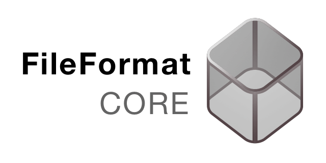
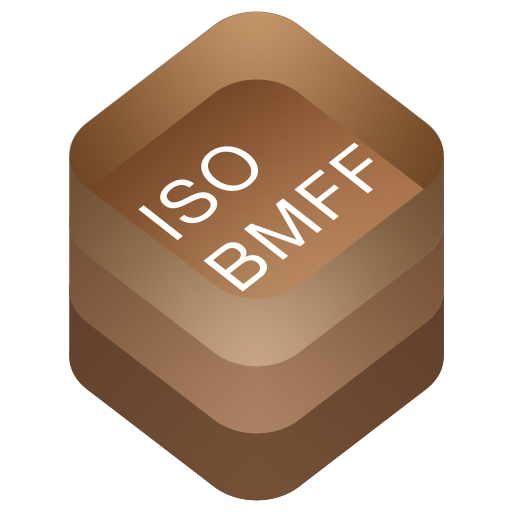
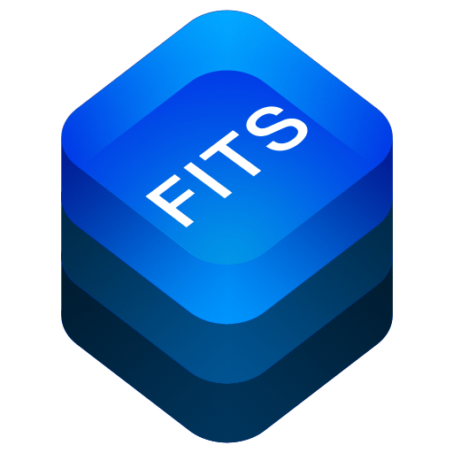

<p align="center">

</p>

<p align="center">
<a href="LICENSE.md">

</a>
<a href="https://swift.org">

</a>


</p>

A native Swift library to read and write custom file formats

## Description
FileFormatCore is asupport library to implement reading and writing custom file formats in pure swift

FileFormatCore consists of two modules
* [FileReader](Doc/FileReader.md) : Read files from disk to memory
* [FileWriter](Doc/FileWriter.md) : Write files from memory to disk

### References
The following projects are based on this project:

|  |
| :----------: |
| *[CSVCore](https://github.com/brampf/csvcore)* |

|  |  |
| :----------: | :----------: |
| *[ISOBMFFCore](https://github.com/brampf/ISOBMFFCore)* | *[HEIFCore](https://github.com/brampf/HEIFCore)* | 

Planned
|  |
| :----------: |
| *[FITSCore](https://github.com/brampf/fitscore)* |


## Getting started

### Package Manager

With the swift package manager, add the library to your dependencies
```swift
dependencies: [
.package(url: "https://github.com/brampf/fileformatcore.git", from: "0.0.3")
]
```

then simply add the `FileReader`  import to your target for the parser

```swift
.target(name: "YourApp", dependencies: ["FileReader"])
```


## License

MIT license; see [LICENSE](LICENSE.md).
(c) 2021
